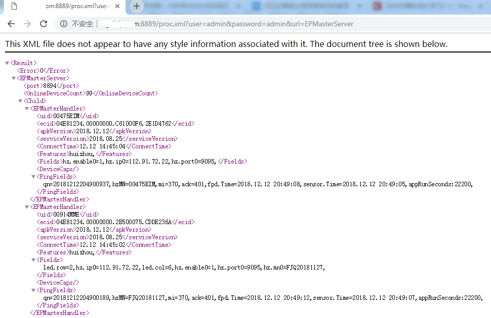

# AJAX
CoreLooper采用AJAX在浏览器中展示app运行时的Handler结构树  
每个Handler都能绑定需要展示在proc.xml中的数据   

效果图如下



如果有时间，可以做精美的网页来更好的展示
这对于开发调试来说是很方便的  
正式运营时也可以使用。

## AjaxHandler
CoreLooper提供了AjaxHandler，用来很方便的扩展ajax指令，比如proc.xml的实现如下:
- .h文件
```cpp
class Ajax_Proc :public AjaxHandler
{
	DECLARE_AJAX_CLASS(Ajax_Proc)
	string Process(const NameValue& params);
};
```

- .cpp文件

```cpp
IMPLEMENT_AJAX_CLASS(Ajax_Proc, "proc", "DeviceConfig")

string Ajax_Proc::Process(const NameValue& params)
{
	string xml;
	LooperImpl* looper = Looper::GetMainLooper();
	if (!looper)
	{
		looper = Looper::CurrentLooper();
	}

	auto url = params.GetString("url");
	if (!url.empty())
	{
		auto obj = looper->FindObject(url);
		if (obj)
		{
			obj->sendMessage(BM_DUMP_PROC_DATA, (WPARAM)&xml);
		}
	}
	else
	{
		looper->sendMessage(BM_DUMP_PROC_DATA, (WPARAM)&xml);
	}

	string ack=StringTool::Format("<Result><Error>0</Error>%s</Result>"
		,xml.c_str()
	);

	return ack;
}

```

## 自定义AJAX指令
可参照上面的Ajax_Proc，借助CoreLooper的Handler,Looper来实现任何功能。  
简单来说，在浏览器url中可以定位指定的Handler,looper，可以传命令叫他们执行,展示数据，修改数据等。  
也可以实现传统的cgi命令的功能。

具体细节请看demo代码
