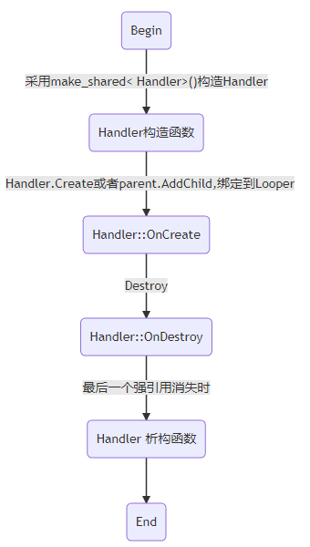

# Handler
Handler是CoreLooper框架管理的基本对象，类似于Android中的Handler,MFC中的CWnd和win32中的HWND
Handler可以使用timer,在同一looper和跨looper sendMessage或者postMessage,侦订其他Handler的消息

### Handler生命周期



#### 创建Handler
采用两段式来创建Handler,
- 第一段是c++语言层面上的创建,即new语义
  Handler必须在heap中创建，不能在stack中创建
  强烈建议采用make_shared来创建c++对象，不要直接调用new,一个new也不要，也不要调用delete,而是全部采用smart pointer来管理

- 第二段是框架层面上的创建,即绑定到Looper，构建parent/child关系
 Handler只能在Looper环境下创建,并且必须绑定到Looper后才能正常使用
框架接口如下
```cpp
virtual void LOOPER_SAFE Create(shared_ptr<Handler> parent);
virtual int LOOPER_SAFE AddChild(std::weak_ptr<Handler> child, std::string name = "");
```
有如下几种典型用法
```cpp
auto obj=make_shared<Handler>();
//此时Handler还没有绑定到Looper,可在Handler构造或者此处传初始化参数
obj.Create(parent);
```
或者更简单一点，在不需要初始化时
```cpp
parent.AddChild(make_shared<Handler>());
```
如果是在父类中调用(一般是在父类.OnCreate)，则可以简化为
```cpp
AddChild(make_shared<Handler>());
```
说明:
- Handler支持跨looper创建,比如在MainLooper中创建Handler然后绑定到WorkLooper中
- 只有绑定到Looper之后,handler才能使用框架提供的功能，比如timer,sendMessage,postMessage等


#### 销毁Handler
```cpp
virtual void LOOPER_SAFE Destroy();
```
采用Handler.Destroy()来销毁Handler,会在Handler绑定的Looper中调用OnDestroy()
app可以多次调用Handler.Destroy()，不会引起错误或不良影响，由框架保证OnDestroy()会被调用并且只被调用一次

销毁和析构是不同的概念
销毁是本框架定义的，析构是c++语言定义的

说明:
- 销毁不影响timer,sendMessage和postMessage等功能，这些功能在销毁后仍然可用
- 销毁后此Handler不能再次Create或者AddChild
- parent销毁时会自动递归销毁其所有的child,依此类推
- parent已销毁时，如果再向它AddChild,此时child能正常创建，但马上自动销毁

#### 析构
当Handler的最后一个shared_ptr失效时会调用析构

##### Handler析构函数在哪个Looper被调用
- 如果只在绑定的Looper内使用Handler,则会在此Looper中析构Handler
- 如果跨Looper使用另一Looper中的shared_ptr< Handler>,并且在Handler.Destroy()后仍然保持此shared_ptr,则有很低的几率跨Looper析构Handler
##### 跨Looper析构Handler详解和解决办法
当调用Handler.Destroy()后,其原生Looper保留一个shared_ptr< Handler>并加到gc(垃圾回收)并且马上检查回收。
另外，当gc列表有项目时Looper会定时检查回收。

回收算法如下
1. 先用weak_ptr引用此Handler
2. 清除shared_ptr< Handler>
3. 对weak_ptr进行lock(),如果为nullptr,说明Handler已析构;如果不为nullptr,说明有外界引用,Handler要重新加到gc列表

假定:
LooperA在gc中引用了HandlerA,
 LooperB用shared_ptr也引用了HandlerA
当LooperA运行完上面第2步,但还没运行第3步，
此时在LooperB中清除它引用的shared_ptr< HandlerA>,则会在LooperB中析构HandlerA

尽管几率很小，这个竞争在框架层面和c++语言层面都没法消除。
最好的解决办法是由app保证自定义的Handler子类能支持跨looper析构。
框架本身的Hanlder是跨Looper析构安全的。

 所以: ** todo ** 框架要提供接口来方便app测试跨Looper析构Handler，增加安全性。

#####  析构总结
框架基本可保证在绑定的Looper中析构Handler(极端情况除外)
框架保证Handler自身跨线looper析构是安全的,app自定义的Handler子类只能由app自行保证
解决办法很简单,Handler.OnDestroy()始终是在绑定的Looper中调用的,Handler子类只需要在OnDestroy()中清理即可。


### 定时器 Timer
``` cpp
	virtual long SetTimer(long& timerId, UINT interval);
	virtual long KillTimer(long& timerId);
	virtual void OnTimer(long timerId);
```

框架内部采用时间轮管理timer
创建，销毁和触发timer的复杂度可认为是O(1),可轻松管理几百万个timer

#### SetTimer
在调用Handler.Create或者.AddChild创建Handler之后，就可以调用SetTimer来创建定时器
参数:
- timerId:输入&输出参数,0为无效值,当传入非0的timerId时,SetTimer会先销毁此timer,再创建并返回新的timerId
- interval为输入参数，表示间隔时间，单位:毫秒,最小精度为1ms,传0时会默认取1ms,实际触发OnTimer的精度取决于OS

#### KillTimer
当不再需要定时器时，可调用KillTimer来销毁

Timer的补充说明:
- 当Handler析构时会自动销毁此Handler创建的所有定时器
- Handler.Destroy()不影响timer

